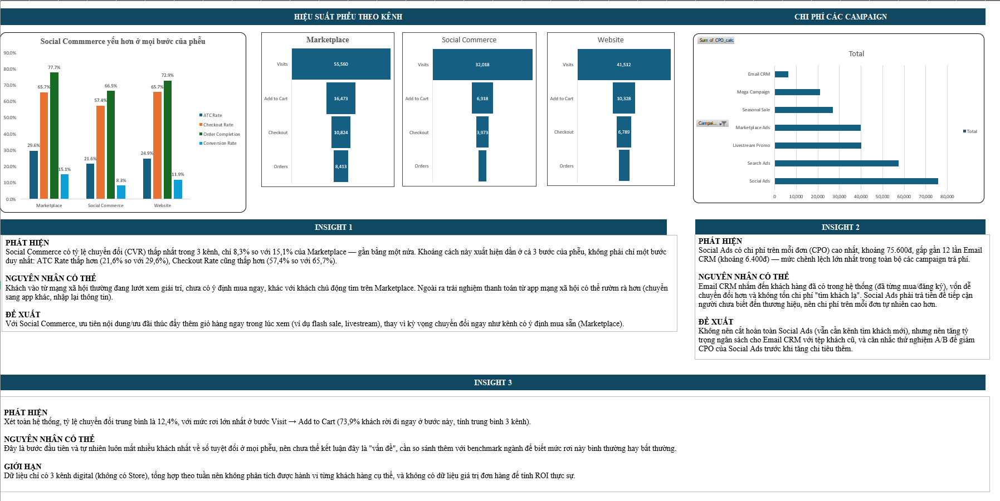

# P1 – Marketing Funnel Analysis

## Business Question
Kênh nào đang rò rỉ khách hàng nhiều nhất trong phễu chuyển đổi (Visits → Add to Cart → Checkout → Order), và campaign nào tốn chi phí nhất trên mỗi đơn hàng?

## Dashboard

## Data
- Nguồn: sheet `Marketing_Funnel` trích từ `Retail_Dataset.xlsx`
- 156 dòng (52 tuần × 3 kênh), từ 01/2025 đến 12/2025
- 3 kênh: Marketplace, Website, Social Commerce
- 10 campaign, gồm cả Organic (không tốn chi phí quảng cáo)

## KPI
| KPI | Công thức |
|---|---|
| ATC Rate | Add_to_Cart / Visits |
| Checkout Rate | Checkout / Add_to_Cart |
| Order Completion | Orders / Checkout |
| Conversion Rate (CVR) | Orders / Visits |
| Cost per Order (CPO) | Ad_Spend / Orders |

Các tỷ lệ tính bằng Sum(tử số) / Sum(mẫu số), không lấy trung bình cộng của tỷ lệ từng tuần, để tránh sai lệch khi quy mô traffic mỗi tuần khác nhau.

## Method
1. Làm sạch và kiểm tra dữ liệu (sheet `DATA`)
2. Tính KPI bằng công thức Excel
3. Tổng hợp bằng PivotTable theo kênh và campaign (sheet `ANALYSIS`)
4. Trực quan hóa bằng PivotChart, biểu đồ phễu (sheet `DASHBOARD`)

## Key Findings
1. **Social Commerce có CVR thấp nhất (8,3%)**, so với Marketplace 15,1% và Website 11,9%. Kênh này thấp nhất ở cả 3 bước: ATC 21,6%, Checkout 57,4%, Order Completion 66,5%.
2. **Social Ads là campaign tốn kém nhất: CPO ≈ 75.600đ**, gấp khoảng 12 lần Email CRM (≈ 6.400đ). Search Ads đứng thứ 2 (≈ 57.400đ).
3. **Bước rò rỉ lớn nhất ở mọi kênh là từ Visits sang Add to Cart**: chỉ 26% lượt truy cập thêm sản phẩm vào giỏ.

## Recommendations
- Rà soát trải nghiệm mua hàng trên Social Commerce (trang sản phẩm, quy trình thanh toán) trước khi tăng ngân sách.
- Xem xét giảm hoặc tối ưu ngân sách Social Ads và Search Ads; ưu tiên các campaign có CPO thấp như Email CRM.

## Limitations
- Dữ liệu funnel là số liệu tổng hợp theo tuần, không nối được với dữ liệu đơn hàng ở sheet Sales.
- Không có Order Value nên chưa đánh giá được ROI, chỉ dừng ở chi phí trên mỗi đơn.
- CPO của Organic = 0 nên được loại khỏi bảng xếp hạng. CPO tổng (blended) thấp hơn CPO thực của từng campaign trả phí.

## Files
- `P1_Marketing_Funnel.xlsx`: file Excel đầy đủ (tải về để xem công thức và PivotTable)
