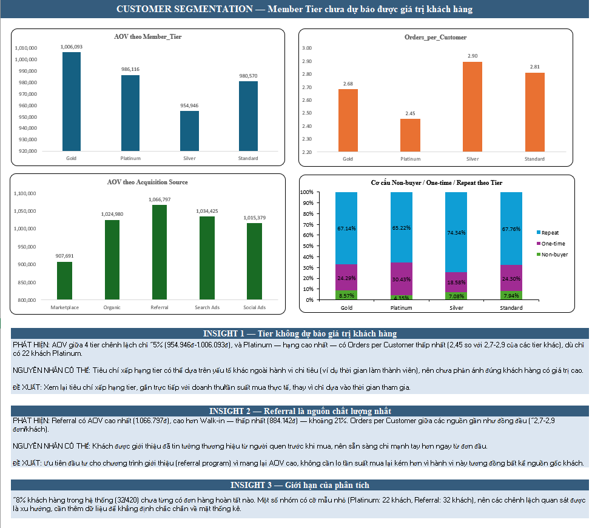

# P2 – Customer Segmentation

## Business Question
Khách hàng Platinum/Gold có thực sự chi tiêu nhiều hơn và trung thành hơn Standard không? Nguồn khách hàng (Acquisition Source) nào mang lại khách chất lượng nhất?

## Dashboard

## Data
- Nguồn: `Sales_Data` + `Customers_Data` trích từ `Retail_Dataset.xlsx`
- 420 khách hàng; 1.650 dòng giao dịch
- 1.081 đơn Completed có Customer_ID hợp lệ (đã tách riêng 68 dòng khách vãng lai không có Customer_ID)

## KPI
- **AOV** = Tổng Net Sales (đơn Completed) / số Order_ID không trùng
- **Orders per Customer** = Tổng số đơn / số khách không trùng
- **Segment**: Non-buyer (0 đơn) / One-time (1 đơn) / Repeat (≥ 2 đơn)

## Method
1. Lọc đơn Completed, ghép đơn hàng với thông tin khách (Member_Tier, Acquisition_Source)
2. Tạo bảng Customer_Profile: số đơn, doanh thu, Segment cho từng khách
3. PivotTable so sánh AOV, Orders per Customer theo Tier và theo Acquisition Source
4. Dashboard 4 biểu đồ kèm 3 insight

## Key Findings
1. **Member Tier chưa dự báo được giá trị khách hàng**: AOV giữa 4 tier chỉ chênh ~5% (954.946đ – 1.006.093đ). Platinum có Orders per Customer thấp nhất (2,45 so với ~2,7–2,9 của các tier khác).
2. **Referral là nguồn khách chất lượng nhất**: AOV 1.066.797đ, cao hơn Walk-in (884.142đ) khoảng 21%. Tần suất mua lại giữa các nguồn gần như đồng đều.
3. **~8% khách (32/420) chưa có đơn Completed nào.**

## Recommendations
- Xem lại tiêu chí xếp hạng tier, gắn trực tiếp với doanh thu và tần suất mua thực tế.
- Ưu tiên đầu tư chương trình giới thiệu (referral program).

## Limitations
- Một số nhóm có cỡ mẫu nhỏ (Platinum: 22 khách mua, Referral: 32 khách), nên chênh lệch chỉ là xu hướng, cần thêm dữ liệu để khẳng định.
- Chỉ phân tích đơn Completed.

## Files
- `P2_Customer_Segmentation.xlsx`: file Excel đầy đủ
